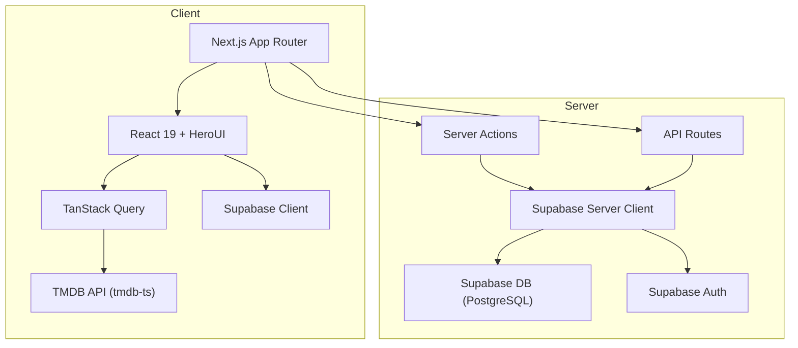
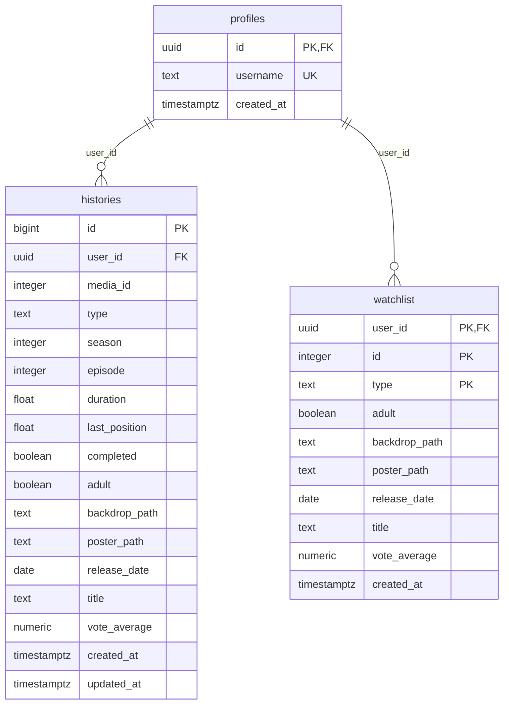

# CINEXTMA — Project Analysis

## Project Identity

| Field | Value |
|---|---|
| **Name** | Cinextma (`cinextma`) |
| **Version** | 1.0.0 |
| **Description** | Free movies & TV shows streaming platform |
| **License** | MIT |
| **Repository** | [github.com/wisnuwirayuda15/cinextma](https://github.com/wisnuwirayuda15/cinextma) |

---

## Technology Stack

| Layer | Technology | Version |
|---|---|---|
| **Framework** | Next.js (App Router + Turbopack) | 16.2.1 |
| **Language** | TypeScript | ^5 |
| **UI Library** | React | 19.2.4 |
| **Styling** | Tailwind CSS | ^4.1.12 |
| **Component Library** | HeroUI | ^2.8.3 |
| **Animations** | Framer Motion | ^12.23.12 |
| **Data Fetching** | TanStack React Query | ^5.85.3 |
| **Forms** | React Hook Form + Zod | ^7.62.0 / ^4.1.1 |
| **Backend / Auth / DB** | Supabase (SSR) | ^2.56.0 |
| **Movie Data API** | TMDB via `tmdb-ts` | ^2.0.2 |
| **State (URL)** | nuqs | ^2.4.3 |
| **PWA** | @ducanh2912/next-pwa | ^10.2.9 |
| **Themes** | next-themes | ^0.4.6 |
| **Analytics** | Vercel Analytics + Speed Insights | ^1.5.0 / ^1.2.0 |
| **Env Validation** | @t3-oss/env-nextjs | ^0.13.8 |
| **Carousel** | Embla Carousel React | ^8.6.0 |

---

## Architecture Overview



### Key Patterns
- **App Router** — All routing uses Next.js 16 file-based App Router (no Pages Router)
- **Server Actions** — Auth, library, histories, and search operations are in `src/actions/`
- **Client-side data fetching** — TMDB queries use TanStack Query via custom hooks
- **URL state** — Discover filters and search params managed via `nuqs`
- **PWA** — Progressive Web App via `next-pwa` (disabled in development)
- **Turbopack** — Dev server uses `--turbopack` for fast HMR

---

## Directory Structure

```
cinex/
├── public/                        # Static assets
│   ├── icons/                     # PWA icons
│   └── manifest.json              # PWA manifest
├── src/
│   ├── actions/                   # Server Actions
│   │   ├── auth.ts                # Auth actions (login, register, logout, etc.)
│   │   ├── histories.ts           # Watch history CRUD
│   │   ├── library.ts             # Watchlist/library CRUD
│   │   └── search.ts              # Search actions
│   ├── api/
│   │   └── tmdb.ts                # TMDB client instance
│   ├── app/                       # Next.js App Router pages
│   │   ├── layout.tsx             # Root layout (Poppins font, navbars, sidebar)
│   │   ├── providers.tsx          # Client providers (Query, HeroUI, Themes, Progress)
│   │   ├── page.tsx               # Home page
│   │   ├── not-found.tsx          # 404 page
│   │   ├── about/                 # /about
│   │   ├── api/                   # API routes
│   │   │   ├── auth/              # Auth callback API
│   │   │   └── player/            # Player proxy API
│   │   ├── auth/                  # /auth (login/register)
│   │   │   └── reset-password/    # /auth/reset-password
│   │   ├── discover/              # /discover (browse with filters)
│   │   ├── library/               # /library (user's watchlist)
│   │   ├── movie/
│   │   │   └── [id]/              # /movie/:id (movie detail)
│   │   │       └── player/        # /movie/:id/player
│   │   ├── search/                # /search
│   │   └── tv/
│   │       └── [id]/              # /tv/:id (TV show detail)
│   │           └── [season]/[episode]/player/  # TV player
│   ├── components/
│   │   ├── sections/              # Feature-specific components
│   │   │   ├── About/             # FAQ
│   │   │   ├── Auth/              # Login, Register, ForgotPassword, ResetPassword, Forms
│   │   │   ├── Discover/          # Filters, ListGroup, MovieList, TvShowList
│   │   │   ├── Home/              # ContinueWatching, List, Cards/Resume
│   │   │   ├── Library/           # List
│   │   │   ├── Movie/             # Cards (Hover, Poster), Detail (Backdrop, Casts, Overview, Related), HomeList, Player
│   │   │   ├── Search/            # Filter, List
│   │   │   └── TV/                # Cards, Details (Backdrop, Casts, Episodes, Overview, Related, Seasons), HomeList, Player
│   │   └── ui/                    # Reusable UI components
│   │       ├── background/        # ThreeDMarquee
│   │       ├── button/            # Back, BackToTop, Bookmark, Copy, Fullscreen, GoogleLogin, Icon, Share, UserProfile
│   │       ├── input/             # GenresSelect, PasswordInput, SearchInput, SelectButton, ThemeSwitchDropdown
│   │       ├── layout/            # TopNavbar, BottomNavbar, Sidebar, Footer
│   │       ├── notice/            # Unauthorized
│   │       ├── other/             # BrandLogo, ContentTypeSelection, Genres, Highlight, Loop, NavbarMenuItems, PhotosSection, PosterCardSkeleton, Rating, SectionTitle
│   │       ├── overlay/           # AdsWarning, ConfirmationModal, Disclaimer, Gallery, Trailer, VaulDrawer
│   │       └── wrapper/           # Carousel
│   ├── config/
│   │   └── site.tsx               # Site config (nav items, themes, TMDB query lists, socials)
│   ├── hooks/                     # Custom React hooks
│   │   ├── useBreakpoints.ts      # Responsive breakpoint detection
│   │   ├── useCustomCarousel.ts   # Embla carousel wrapper
│   │   ├── useDeviceVibration.ts  # Haptic feedback
│   │   ├── useDiscoverFilters.ts  # Discover page filter state (nuqs)
│   │   ├── useExtractColors.ts    # Color extraction from images
│   │   ├── useFetchDiscoverMovies.ts  # Infinite query for discover movies
│   │   ├── useFetchDiscoverTvShow.ts  # Infinite query for discover TV
│   │   ├── usePlayerEvents.ts     # Player iframe event handling
│   │   └── useSupabaseUser.ts     # Current user state
│   ├── proxy.ts                   # Proxy utility
│   ├── schemas/
│   │   └── auth.ts                # Zod schemas for auth forms
│   ├── styles/
│   │   ├── globals.css            # Global styles + Tailwind imports
│   │   ├── lightbox.css           # Lightbox custom styles
│   │   └── embla-carousel.module.css  # Carousel module styles
│   ├── types/
│   │   ├── index.ts               # Core app types (SiteConfig, NavItem, etc.)
│   │   ├── component.ts           # Component prop types
│   │   └── movie.ts               # Movie/TV-related types
│   ├── utils/
│   │   ├── constants.ts           # App constants (IS_PRODUCTION, spacing classes)
│   │   ├── env.ts                 # Type-safe env vars (@t3-oss/env-nextjs)
│   │   ├── fonts.ts               # Font configuration (Poppins)
│   │   ├── helpers.ts             # General utility functions (cn, etc.)
│   │   ├── hero.ts                # Hero section utilities
│   │   ├── icons.ts               # Icon mappings
│   │   ├── movies.ts              # Movie data transformation utilities
│   │   ├── parsers.ts             # nuqs search param parsers
│   │   ├── players.ts             # Player source configuration
│   │   ├── settings.ts            # App settings
│   │   └── supabase/
│   │       ├── client.ts          # Browser Supabase client
│   │       ├── server.ts          # Server Supabase client
│   │       ├── middleware.ts       # Supabase auth middleware
│   │       └── types.ts           # Auto-generated Supabase DB types
│   └── public/
│       └── img/                   # Source images
├── supabase/
│   ├── config.toml                # Supabase local dev config
│   ├── migrations/
│   │   └── 20250902162351_initial_diff.sql  # Initial DB migration
│   ├── schemas/                   # DB schema definitions
│   └── templates/                 # Email templates
├── next.config.ts                 # Next.js config (PWA, Turbopack, HeroUI optimization)
├── tsconfig.json                  # TypeScript config (path alias: @/* → ./src/*)
├── package.json
├── postcss.config.mjs
├── .eslintrc.json
└── .env.local.example             # Required env vars template
```

---

## Routes

| Route | Description |
|---|---|
| `/` | Home — Trending, popular, now playing carousels + continue watching |
| `/discover` | Browse movies/TV with genre, sort, and type filters |
| `/search` | Search movies and TV shows |
| `/library` | User's personal watchlist (auth required) |
| `/movie/[id]` | Movie detail — backdrop, overview, cast, related |
| `/movie/[id]/player` | Movie player with source selection |
| `/tv/[id]` | TV show detail — seasons, episodes, cast, related |
| `/tv/[id]/[season]/[episode]/player` | TV episode player |
| `/auth` | Login / Register page |
| `/auth/reset-password` | Password reset page |
| `/about` | About page with FAQ |
| `/api/auth/*` | Auth callback handler |
| `/api/player/*` | Player proxy endpoint |

---

## Database Schema (Supabase / PostgreSQL)



### Row Level Security (RLS)
All tables have RLS enabled:
- **profiles** — Public read, users can insert/update own profile
- **histories** — Users can only CRUD their own history records
- **watchlist** — Users can only view/insert/delete their own watchlist items

---

## Environment Variables

### Server-side
| Variable | Required | Description |
|---|---|---|
| `SUPABASE_SERVICE_ROLE_KEY` | ✅ | Supabase service role key |
| `PROTECTED_PATHS` | Optional | Comma-separated protected route paths |

### Client-side
| Variable | Required | Description |
|---|---|---|
| `NEXT_PUBLIC_TMDB_ACCESS_TOKEN` | ✅ | TMDB API read access token |
| `NEXT_PUBLIC_SUPABASE_URL` | ✅ | Supabase project URL |
| `NEXT_PUBLIC_SUPABASE_PUBLISHABLE_KEY` | ✅ | Supabase anon/public key |
| `NEXT_PUBLIC_CAPTCHA_SITE_KEY` | Optional | Cloudflare Turnstile captcha key |
| `NEXT_PUBLIC_AVATAR_PROVIDER_URL` | Optional | Avatar service URL for user profiles |
| `NEXT_PUBLIC_MEDIAFLOW_URL` | Optional | MediaFlow proxy base URL |
| `NEXT_PUBLIC_MEDIAFLOW_PASSWORD` | Optional | Optional password for non-public MediaFlow proxy |

### Supabase Local Dev (`.env`)
| Variable | Description |
|---|---|
| `SUPABASE_AUTH_GOOGLE_CLIENT_ID` | Google OAuth client ID |
| `SUPABASE_AUTH_GOOGLE_SECRET_KEY` | Google OAuth secret |
| `SUPABASE_AUTH_SMTP_*` | SMTP config for auth emails |

---

## Stats

| Metric | Count |
|---|---|
| **Total source files** (`.ts`, `.tsx`, `.css`) | 134 |
| **Pages / Routes** | 12 |
| **Section components** | ~50 |
| **UI components** | ~30 |
| **Custom hooks** | 9 |
| **Server actions** | 4 modules |
| **DB tables** | 3 (profiles, histories, watchlist) |
| **DB migrations** | 1 |

---

## Key Features Summary

| Feature | Status |
|---|---|
| 🎬 Movie browsing & streaming | ✅ Finished |
| 📺 TV show browsing & streaming | ✅ Finished |
| 🔍 Search (movies & TV) | ✅ Finished |
| 🧭 Discover with filters | ✅ Finished |
| 👤 User accounts (Supabase Auth) | ✅ Finished |
| 📚 Watchlist / Library | ✅ Finished |
| 📜 Watch history with resume | ✅ Finished |
| 🌗 Light / Dark / System theme | ✅ Finished |
| 📲 Progressive Web App (PWA) | ✅ Finished |
| 🏆 Achievements system | 🔜 Planned |
| ⚙️ Personal settings | 🔧 WIP |
| 🌐 Social features | 🔜 Planned |
